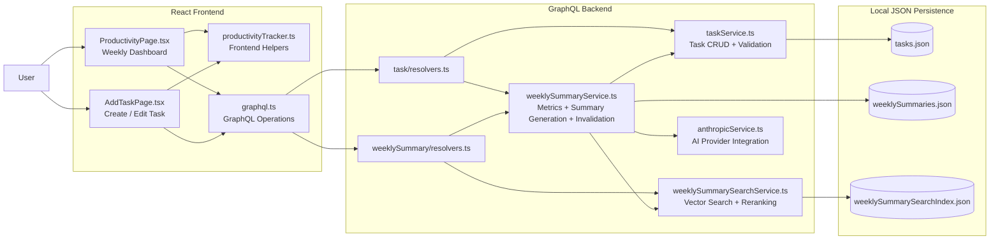

# builders-challenge

Welcome to my submission! 

This project implements a productivity tracker with three main pieces.

* **Core Productivity Tracker**

  * I built a React productivity tracker for logging daily tasks with a name, time spent, focus level, category, and date.
  * Users can create, edit, delete, and review tasks across weekly views with local persistence.

* **GenAI Task Part One**

  * I added a backend summary flow that computes weekly productivity metrics from the logged tasks.
  * Users can generate a one-paragraph AI summary with suggestions for improving focus and efficiency the following week.

* **GenAI Task Part Two**

  * I store generated summaries, suggestions, and weekly metadata on the backend.
  * The historical search feature indexes those summaries so users can ask natural-language questions and find past weeks with similar productivity patterns.


## Repo structure

* Within the `frontend/` directory, the main productivity tracker files are:

  * `src/components/ProductivityTrackerPage/ProductivityPage.tsx`

    * Main dashboard wizard where user can switch weeks, toggle task display views, generate weekly summaries, and search existing task data using natural language.
  * `src/components/ProductivityTrackerPage/AddTaskPage.tsx`

    * Create/edit task page used for adding, updating, and deleting productivity entries.
  * `src/components/ProductivityTrackerPage/graphql.ts`

    * GraphQL queries and mutations used by the productivity tracker frontend.
  * `src/components/ProductivityTrackerPage/productivityTracker.ts`

    * Shared frontend helpers for week math, formatting, chart data, filters, and stale-summary detection.

* Within the `backend/` directory, the main productivity tracker files are:

  * `server/entities/task/resolvers.ts`

    * GraphQL task query/mutation entrypoints.
  * `server/entities/weeklySummary/resolvers.ts`

    * GraphQL summary generation and historical search entrypoints.
  * `server/services/taskService.ts`

    * File-backed task CRUD and validation logic.
  * `server/services/weeklySummaryService.ts`

    * Weekly summary generation, metric calculation, persistence, and invalidation logic.
  * `server/services/weeklySummarySearchService.ts`

    * LangChain-compatible vector search, deterministic embeddings, search index syncing, and reranking logic.
  * `server/scripts/seedJuneDemoData.ts`

    * Script for loading sample June task data, prebuilt summaries, and the historical search index.

## System design



## Running locally

The recommended way to review this submission is to run the frontend and backend locally with `npm install` and `npm run dev`.

From the backend directory:

```bash
cd backend
npm install
cp .env.keep .env
npm run dev
```

From the frontend directory, in a separate terminal:

```bash
cd frontend
npm install
npm run dev
```

Once both servers are running, open the local frontend URL printed by the React/Vite dev server.

## Environment configuration

The app can run without an Anthropic API key if you use the seeded demo data. To enable live AI weekly summary generation, add your Anthropic API key to the backend `.env` file:

```bash
ANTHROPIC_API_KEY=your_api_key_here
```

The AI provider call is handled on the backend so provider credentials are not exposed to the frontend.

## Vector store and agent setup

The historical productivity search feature is implemented in:

```bash
backend/server/services/weeklySummarySearchService.ts
```

This file contains:

* A LangChain-compatible local vector store wrapper.
* A deterministic local embedding implementation.
* Search document generation from saved weekly summaries.
* Vector similarity search.
* Productivity-specific reranking based on task count, total hours, categories, and focus levels.
* A lightweight productivity search agent that explains why returned weeks matched the query.

No hosted vector database is required. The vector index is persisted locally as JSON and can be rebuilt from saved weekly summaries.

Install backend dependencies with:

```bash
cd backend
npm install
```

Then seed the demo data and rebuild the vector index with:

```bash
npm run seed:demo-data
```

After seeding, the historical search feature can be tested immediately from the frontend with queries like:

```text
show me my coding-heavy weeks
```

```text
when was I most productive?
```

```text
show me low focus weeks
```

## Sample data

The repository includes a seed script for reviewer testing:

```bash
backend/server/scripts/seedJuneDemoData.ts
```

Run it with:

```bash
cd backend
npm run seed:demo-data
```

The script populates the app with June demo tasks, writes prebuilt weekly summaries, and rebuilds the local historical search index. This allows reviewers to test the dashboard, charting, weekly summary display, and historical search without manually entering data or consuming API credits.

## Docker

Docker support is included to satisfy the submission requirements, but I am still actively workshopping the containerized setup. For now, the local npm run dev workflow is the most reliable way to evaluate the application.

```bash
cd backend && npm install && cp .env.keep .env && npm run dev
cd frontend && npm install && npm run dev
```

## Technical tradeoffs

For more detail on architecture decisions, library choices, model/provider decisions, vector search design, and persistence tradeoffs, see:

```bash
TechnicalDecisions.md
```

